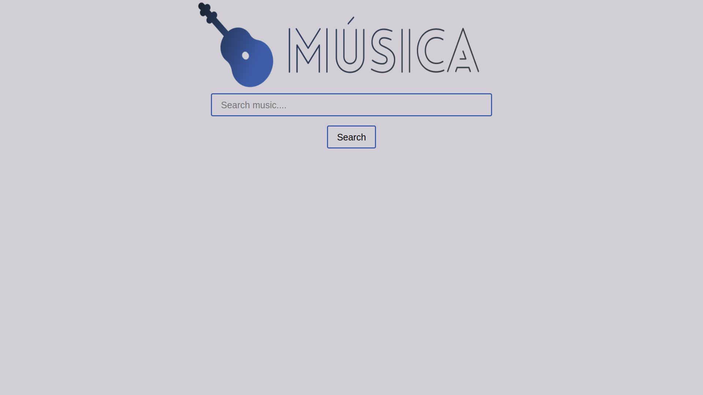
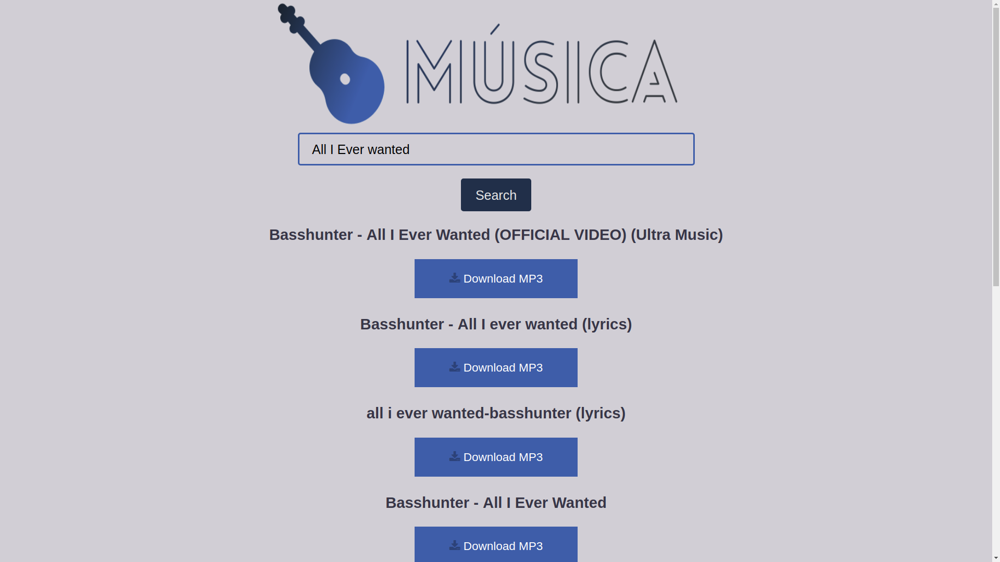

# Música :guitar:

 

A simple web app where you can download music for free in just one click.The web app is made using **React JS** which makes it very fast. :thunder:

## Features 

You can search the music you want to download in the search engine. Press enter. Direct download buttons of top 10 results of that song will appear below the search bar.

## How to run 

### To run online

Click here : https://musica1.herokuapp.com

### To run offline

Follow these steps : 

- Clone the repo and enter the directory 
- `yarn install`
- `yarn run build:prod`
- `node server/server.js`
- Goto https://localhost:3000

## Screenshots

## Contributions 

If you find any flaws in the web app, do open an Issue. Contribution are always welcome and will be accepted if it makes the web app better. :smile:

## License 

#### [MIT](./LICENSE)